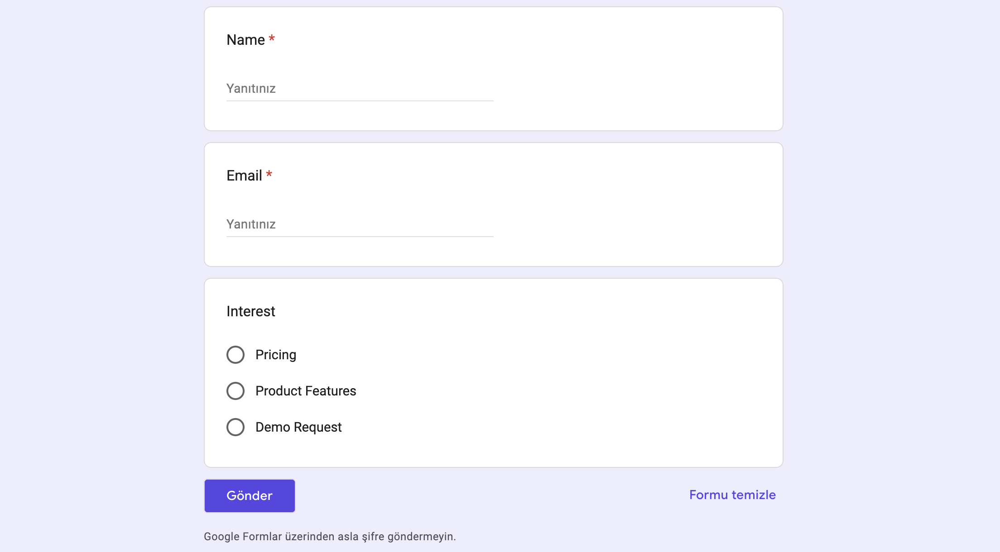
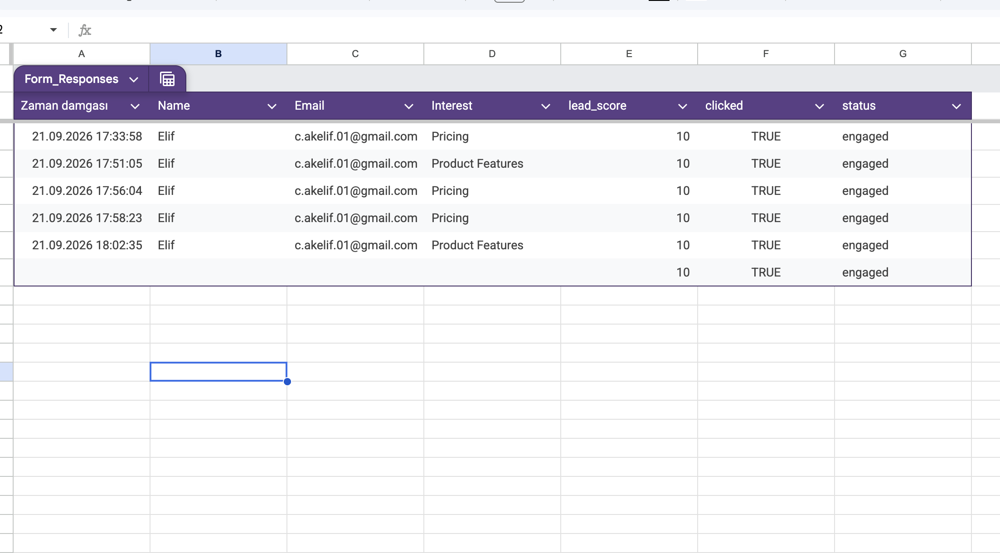
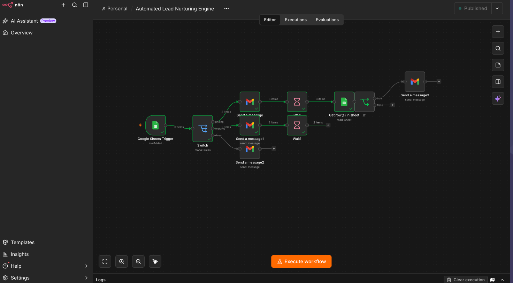
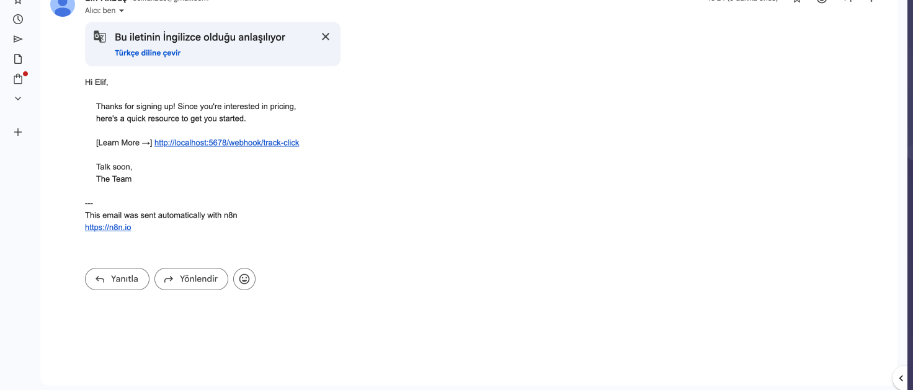
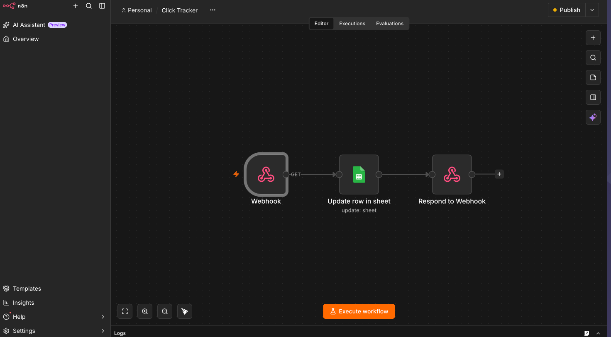

# Lead Nurture Automation (n8n)

This project is an end-to-end marketing automation system that 
automatically segments leads coming from a Google Form, sends 
personalized emails, tracks link clicks, and automatically sends 
a reminder email to users who haven't engaged. Built with the 
n8n workflow automation tool.

## Purpose

Most companies send the same generic email to every lead that 
fills out a form. This project increases conversion by sending 
a personalized email based on the user's stated interest 
(Pricing / Features / Demo) on the form, and automatically 
re-engages users who don't click the link by sending a follow-up 
reminder after a set period.

## System Architecture

1. The user fills out a Google Form (Name, Email, Interest)
2. The form response is automatically added to a Google Sheet
3. n8n detects the new row (Google Sheets Trigger)
4. A Switch node routes the lead into one of three branches 
   based on their interest: Pricing / Features / Demo
5. A personalized welcome email is sent for that branch. The 
   link inside the email points to an n8n Webhook first, rather 
   than the destination page directly
6. When the user clicks the link, a separate "Click Tracker" 
   workflow is triggered, which updates the corresponding row 
   in Google Sheets (clicked: TRUE, lead_score: 10, status: engaged)
7. Back in the main workflow, a Wait node pauses execution for a 
   set period (2 days in a real-world scenario)
8. Once the wait ends, the system re-checks the Sheet: if the 
   user still hasn't clicked, an automatic reminder email is sent

## Tech Stack

- n8n (workflow automation platform)
- Google Forms
- Google Sheets (used as a lightweight database)
- Gmail API (email delivery)
- Webhooks (click tracking)

## Screenshots

### Google Form

### Google Sheets — Data Store

### Main Workflow — Overview

### Received Welcome Email

### Click Tracker Workflow

## Setup & Installation

1. Install n8n locally (`npm install n8n -g` or via Docker)
2. Import both JSON files from the `workflows/` folder into your n8n instance
3. Create your own Google Sheets and Gmail OAuth2 credentials via 
   Google Cloud Console
4. Create your own Google Form and link it to a Sheet, matching 
   the form fields to the Sheet columns
5. Activate both workflows

## Production Note

This project was built as a demo/portfolio piece, so the Webhook 
URL runs on localhost and is not publicly accessible. In a real 
production environment, this URL would need to be exposed via a 
tunneling service like ngrok, or the workflow would need to be 
hosted on a service like n8n.cloud.

Also note that the Wait node is set to 1 minute for demo purposes; 
in a real-world scenario this would be set to 2 days.

## Developer Notes

This project demonstrates how a form-based lead capture process 
can be fully automated end-to-end, and how personalized, no-code/
low-code marketing flows can be built without writing backend code.
